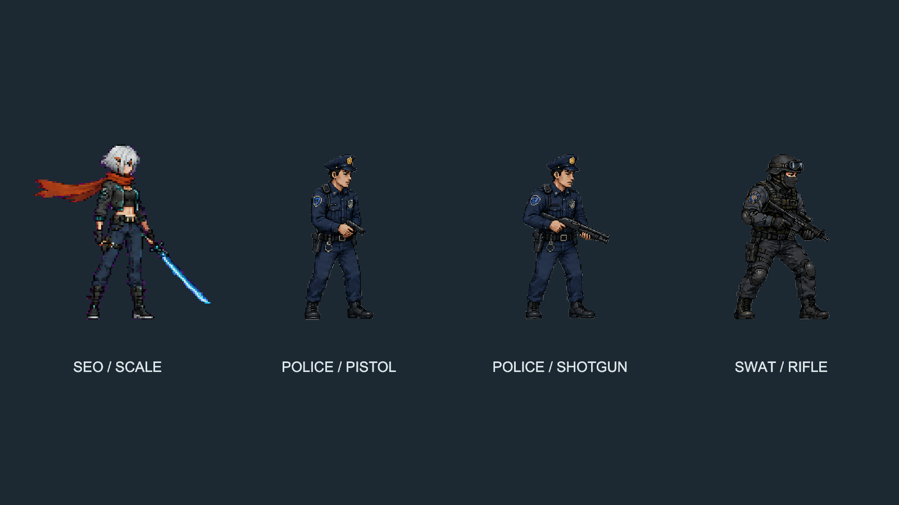

# 경찰·특수대응팀 전용 스프라이트

2026-09-07, AFTERSIGNAL Unity. 기존 캠페인 적 `Enemies/gunner`를 경찰에게 재사용하던 연결을 전용 인간 캐릭터로 교체했다.

| 출동 유형 | Resources/Art/LawEnforcement 에셋 | 외형 |
| --- | --- | --- |
| 권총 경찰 | `PolicePistol.png` | 남색 제복, 정모, 방패 배지, 경찰 장비 벨트 |
| 샷건 경찰 | `PoliceShotgun.png` | 같은 제복 계열, 양손 샷건 자세 |
| 소총 특수대응팀 | `SwatRifle.png` | 헬멧, 고글, 안면 가리개, 방탄 조끼, 무릎 보호대 |

수배 단계에 따른 기존 출동 인원·무기 배정은 유지한다. `PoliceSpriteCatalog`가 무기별 에셋을 선택하며 `PoliceOfficer`가 사용한다. 손과 총은 함께 그렸으므로 경찰에게 생성하던 별도의 `EnemyWeaponRig`는 제거했다. 캠페인 적의 외형과 무기 리그는 유지한다.

## 프레임

세 시트 모두 4열 × 2행, 8프레임이다. 좌우 반전은 기존 `PixelActor`가 처리한다.

| 인덱스 | 동작 |
| --- | --- |
| 00 | 대기 / 총을 낮춰 든 자세 |
| 01 | 달리기 / 넓은 보폭 |
| 02 | 달리기 / 발 교차 자세 |
| 03 | 조준 |
| 04 | 사격 반동, 총구 섬광, 탄피 |
| 05 | 피격 |
| 06 | 무릎을 꿇으며 쓰러짐 |
| 07 | 지면에 누운 최종 자세 |

최종 쓰러짐은 이미 누운 그림이므로 이전 적 프레임에 사용하던 80도 회전을 적용하지 않는다.

## 가져오기

`PoliceSpriteImporter`가 배경과 인물을 구분해 8개 스프라이트를 자동 분리한다. 가로로 긴 최종 쓰러짐과 떨어진 탄피·섬광도 포함하며, 발을 기준으로 피벗을 잡는다. 한 시트의 모든 프레임에 같은 Pixels Per Unit을 적용해 첫 대기 자세의 키를 2.1 Unity 단위에 맞춘다. Point 필터, RGBA32, 무압축, 밉맵 없음이다.

생성기의 최종 PNG는 흰 배경을 포함한다. PNG 원본을 변경하지 않고 Unity 가져오기 과정에서 밝은 중성 배경을 알파로 전환한다. 따라서 파일 탐색기로 PNG를 보면 흰 배경이 보이지만 게임에는 투명 스프라이트로 들어간다. 일반 `ArtImporter`는 이 폴더를 전용 가져오기에 맡긴다.

## 제작 출처

이 프로젝트용 신규 그림으로 `image_gen.imagegen` 도구를 사용했다. 제복/장비 시트를 생성한 후, 같은 도구로 달리기 프레임의 차이, 가로로 누운 자세, 평평한 배경을 수정하고 권총 제복을 참고해 샷건 시트를 제작했다. 외부 게임의 캐릭터 이미지를 복사하지 않았다. 사용한 생성·수정 프롬프트 전문은 [police-prompts.json](police-prompts.json)에 보관했다.

## 필수 확인

`-police-art-smoke` 실행 옵션은 실제 경찰 생성 경로로 세 무기 유형을 만들고 24개 스프라이트 로드, 적 에셋/중복 무기 미사용, 키를 확인한다. 게임의 URP 카메라로 모든 프레임과 좌우 방향을 출력한다. 저장 및 수배 등급을 바꾸지 않는 명시적 검사이며 일반 실행에서는 활성화되지 않는다.

최종 Windows Release 빌드 성공(오류 0, 기존 경고 35), 네이티브 필수 확인 9개 통과 및 프로세스 종료 코드 0. 24프레임, 좌우 반전, 투명 배경과 서하와의 상대 크기를 URP 렌더링으로 확인했다. 최종 로그는 `Artifacts/PoliceArt/build-release.log`, 실행 결과와 프레임별 비교는 `Artifacts/PoliceArt/Release`에 있다. 전체 캠페인 회귀 검사는 반복하지 않았다.

