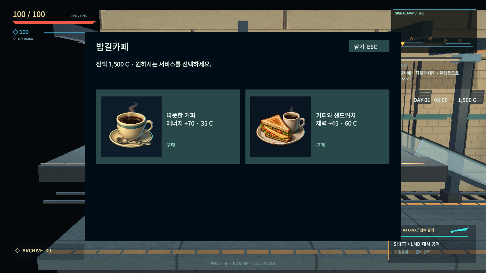
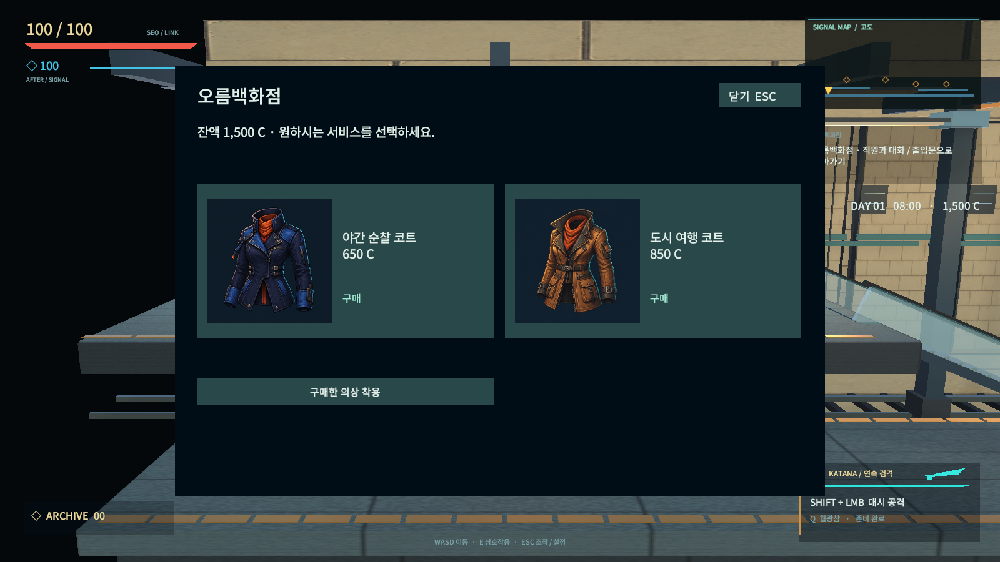

# 상점 구매 아이템 이미지

AFTERSIGNAL 상점에서 판매하는 의상 2종과 음식·음료 6종을 새 픽셀 일러스트로 제작했다. 서비스 구매 화면은 품목 이미지, 이름, 효과, 가격과 구매 동작을 한 카드에 표시한다. 보유한 구매 의상은 옷장에서도 같은 이미지를 사용한다.

| 에셋 | 품목 | 판매처 | 가격 |
| --- | --- | --- | --- |
| `NightCoat.png` | 야간 순찰 코트 | 백화점·의류점 | 650 C |
| `TravelCoat.png` | 도시 여행 코트 | 백화점·의류점 | 850 C |
| `LunchBox.png` | 도시락 | 마트 | 45 C |
| `EnergyDrink.png` | 에너지 음료 | 마트 | 35 C |
| `WarmMeal.png` | 따뜻한 정식 | 식당 | 90 C |
| `SpecialMeal.png` | 든든한 특선 | 식당 | 140 C |
| `Coffee.png` | 따뜻한 커피 | 카페 | 35 C |
| `SandwichSet.png` | 커피와 샌드위치 | 카페 | 60 C |

원본 위치: `Assets/AfterSignal/Resources/Art/ShopItems`. 정사각형 원본 PNG를 보존하고 Unity에서는 최대 512px, Sprite Single, 가운데 피벗, Bilinear, 밉맵 없음, Clamp, 무압축으로 가져온다. 그림은 어두운 남색 바탕을 포함한 상품 일러스트이며 글자는 게임 UI가 표시한다.

`LifeOption.image`가 명시적인 품목 키를 전달하고 `ShopItemArt`가 스프라이트를 캐시한다. 표시 문구를 파싱해 이미지를 추측하지 않는다. `LifeHud`가 구매 카드와 일반 서비스 버튼을 배치하며 아이템 이미지 자체는 클릭을 가로채지 않는다. 가격·효과·결제 콜백은 기존 로직을 유지한다. 은행, 벌금, 치료, 숙박 등 서비스는 일반 서비스 메뉴로 표시한다.

모든 이미지는 2026-09-07 이 프로젝트용으로 built-in `image_gen.imagegen` 도구를 사용해 제작했다. 품목별 생성 프롬프트 전문은 [shop-item-prompts.json](shop-item-prompts.json)에 있다. 이미지 API CLI나 프로젝트의 NPC 대화 API 키는 사용하지 않았다.

`-shop-art-smoke`는 8개 패키지 이미지 로드, 네 종류 상점 메뉴의 카드 표시, 품목 연결, 실제 구매 버튼 결제, 잔액 부족과 일반 메뉴 복귀만 확인한다. 생활 재화 저장을 비활성화하고 테스트한 시설 선택을 복원한다. 전체 캠페인 회귀는 반복하지 않는다.

최종 Windows 빌드 성공(오류 0, 기존 경고 35), 네이티브 UI 확인 9개 통과 및 종료 코드 0. 실제 서비스 메뉴와 UI 버튼을 실행했고 시설 이동 검사는 반복하지 않았다. 결과는 `Artifacts/ShopItems/Final/shop-art.json`, 최종 빌드 로그는 `Artifacts/ShopItems/build-release.log`이다. 열려 있는 에디터를 유지하기 위해 별도 작업 복사본에서 빌드하고, 확인한 실행 파일을 `Builds/Windows`에 반영했다. 임시 복사본 삭제는 실행 정책에 의해 차단되어 Git에서 제외된 `Artifacts/ShopItems/BuildWorkspace`에 남아 있다.

