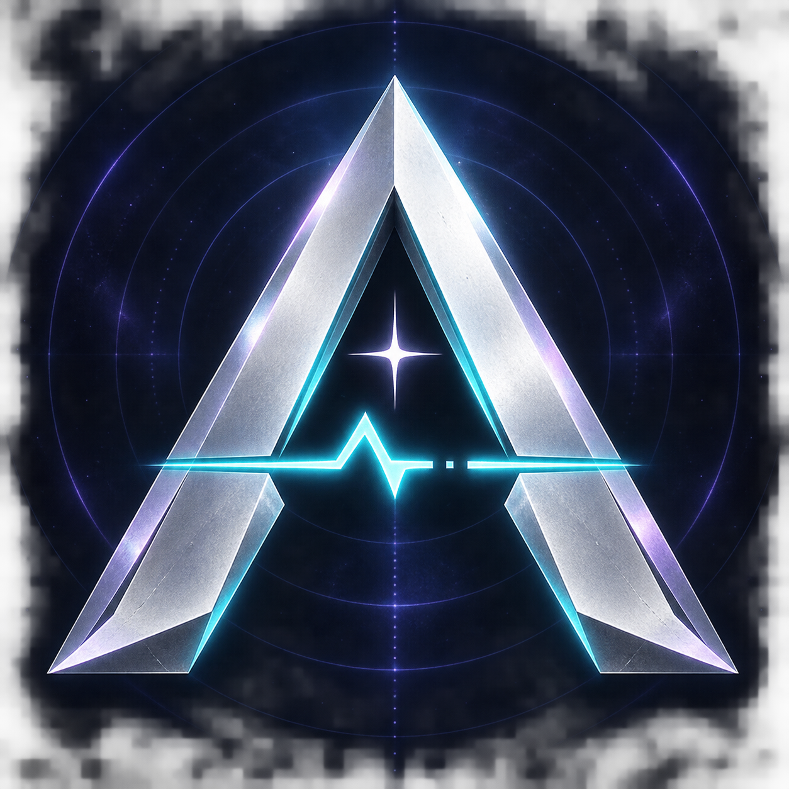

# AFTERSIGNAL 게임 아이콘



- 파일: [aftersignal-icon.png](aftersignal-icon.png)
- 디자인: 은백색 A, 청록색 신호 파형, 별과 어두운 남색 배경. 타이틀의 색상과 끊어진 신호를 다시 연결하는 게임 설정을 반영했습니다.
- 제작: 2026-09-10, Codex 내장 `image_gen` 도구. 생성된 PNG를 보정 없이 저장했습니다.
- 공개 범위: 사용자 요청에 따라 이 완성 아이콘만 공개합니다. 다른 게임 이미지·3D 원본의 비공개 정책은 유지합니다.
- 현재 적용: 저장소 README. 기존 Windows 실행 파일의 아이콘을 교체하거나 플레이어를 재빌드하지는 않았습니다.

## 최종 생성 프롬프트

```text
Use case: logo-brand.
Asset type: finished square PC game application icon for AFTERSIGNAL, an original Korean cyberpunk open-world action game about recovering stolen memories and reconnecting a broken signal in a futuristic city.
Primary request: Create one extremely polished, distinctive icon, 1024 x 1024, full bleed square.
Subject: a bold angular capital A emblem built from two beveled pearl-silver metal strokes, with a sharp horizontal cyan signal pulse passing through its lower middle and one small four-point white star inside the triangular negative space. The A should be instantly recognizable, dominant, occupying 70 percent of the canvas. A very restrained break in the signal suggests a lost connection, not broken sloppy geometry.
Scene/backdrop: rich near-black midnight navy, extremely subtle concentric signal echoes and a faint violet atmospheric halo. No complex city illustration.
Style: premium sci-fi game branding, sophisticated machined metal, crisp hard silhouette, restrained electric turquoise edge highlights, pale silver-white main face, small lavender reflections reminiscent of the protagonist Seoha's silver-lavender hair. High contrast at tiny desktop icon size. Front view, no tilted perspective.
Composition: centered, balanced, generous 12 percent safety margin around the emblem. The emblem reads cleanly at 32 and 64 pixels. Background extends to all four square edges, no outer rounded-square frame. Controlled glow without haze swallowing the edges.
Text: only the stylized A emblem, no title words, no subtitle, no watermark, no extra letters.
Avoid: existing franchise logos, generic power button, excessive ornamental circuitry, microscopic details, multiple alternatives, mockup scenes, app grids, giant bloom.
```
