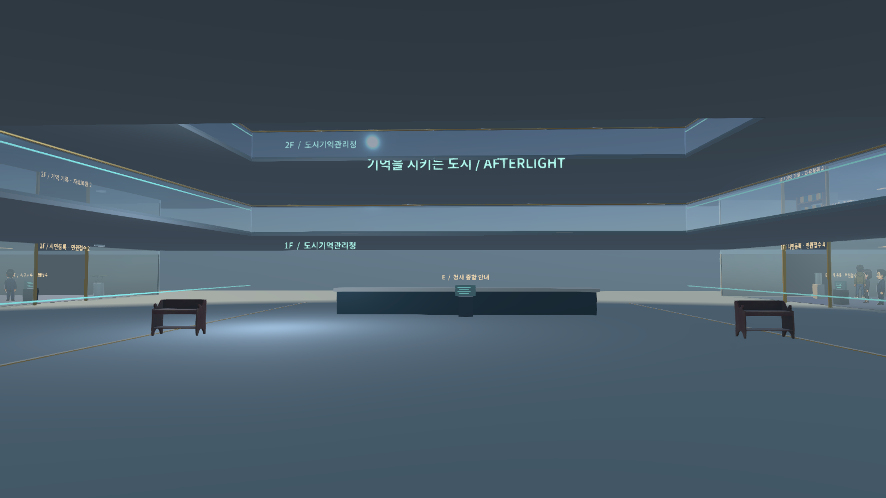
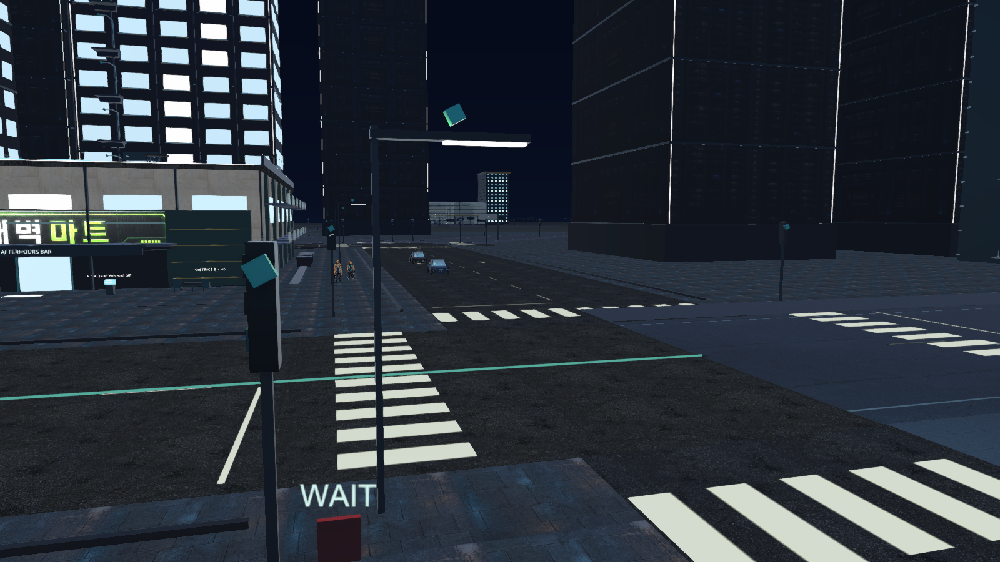
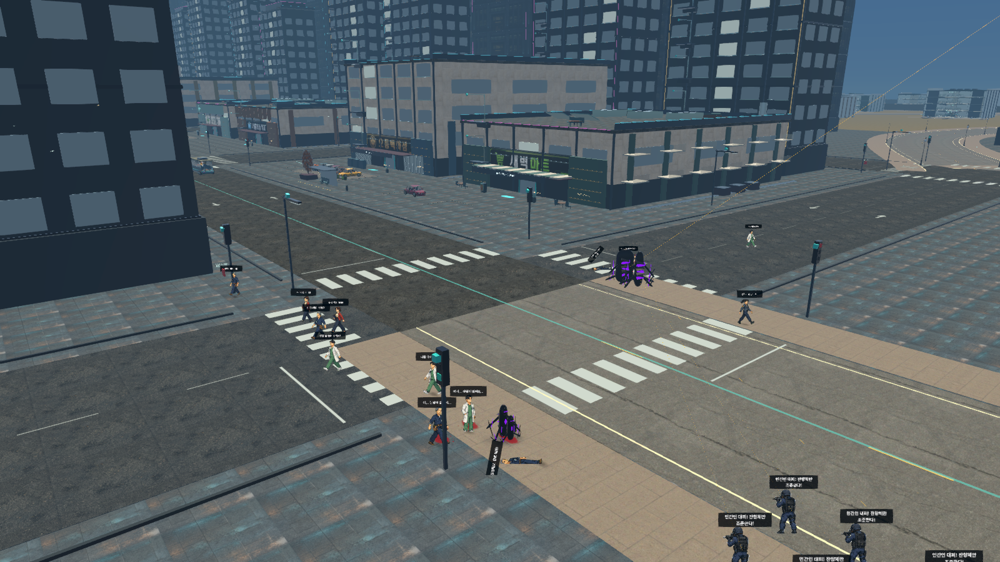

# 도시 시설·전투 확장

2026-09-08. 서하는 기존 2D 일러스트 스프라이트를 유지한다. BGM과 AI 대화 연결은 변경하지 않았다.

## 이용 방법

- 시민과 경찰에게 몸이 부딪히면 실제 캡슐 충돌과 성격별 말풍선이 발생한다. 같은 NPC의 접촉 대사는 6초 간격으로 제한된다.
- 보호 대상 퀘스트 NPC와 몬스터를 제외한 사망자는 78% 확률로 현금을 떨어뜨린다. 가까이 다가가거나 E로 줍는다. 시민이 이미 강탈당한 현금은 중복으로 떨어뜨리지 않는다.
- 차량 폭발은 거리별 피해와 넉백을 주며 벽이 피해를 차단한다. 인근 차량도 피해를 받아 연쇄 폭발할 수 있다.
- BLACKLINE 무기 매장은 도시 좌표 `(950, 0, 260)`에 있다. 백화점·상점과 군부대 보급 창구에서도 이용할 수 있다.
- 숫자 1 검 / 2 대검 / 3 권총 / 4 소총 / 5 수류탄 / 6 바주카 / 7 산탄총. LMB 공격, R 장전. 소총·산탄총·바주카는 탄창과 예비탄을 소비하고, 수류탄은 개수 단위로 소비한다. 기존 기본 권총의 장전 규칙은 유지된다.
- 소총·바주카·산탄총은 별도의 입체 장비가 조준 방향을 따른다. 캐릭터의 상체는 기존 권총 계열 8방향 애니메이션을 사용한다.
- 현장 업무는 안내받은 세 작업 지점으로 이동해 E로 처리하면 보수를 받는다. 같은 업무는 게임 내 하루에 한 번 가능하다.
- 도시기억관리청은 `(840, 0, 870)`에 있다. 지도에서 선택할 수 있으며 중앙 청사 6개 층은 계단·승강기로 이동한다. 시민 등록, 기억 기록 복원, 의료·복지, 국방 연락, 기반시설, 복원망 업무를 제공한다.
- 등록비 100 C로 복원 근무자가 되면 현장 업무 보수가 10% 증가한다.
- 벤치·자판기·급수기·ATM·보관함·서적·의료 단말·작업대 등은 E로 이용한다. 은행 예금, 치료, 숙박, 수리·튜닝, 카페 아르바이트 등 기존 기능과 연결된다.
- 야간에는 네온·창문·간판 발광이 강해지고 플레이어 주변 가로등에 실제 점광원이 켜진다. 실시간 조명은 최대 40개를 재사용한다.
- 시내 지상에서 일정 시간이 지나면 신호 균열과 잔향체가 무작위로 출현한다. 국방대응부 6명과 지원 헬기가 출동해 싸운다. 서하가 진압에 참여하면 350 C를 받는다.

## 구현 범위

기존 시내 40개 건물에는 용도별 외벽 기둥, 발코니, 차양, 차고 문, 설비와 색상·배치 차이를 추가했다. 확장 지역의 기존 입주 건물 29개에는 개별 외관과 층별 시설 단말을 배치했다. 실내는 병원, 학교, 은행·경찰, 정비·물류, 주거·휴게 공간에 맞는 설비와 이용 가능한 사물을 추가한다. 기존 층 구조와 바닥은 유지하며, 모든 건물을 완전히 새로운 수작업 모델로 교체한 것은 아니다.

정부청사는 6층 중앙 건물과 기록 보관용 외부 고층 타워 두 동, 광장, 주차장 및 연결도로로 구성된다. 중앙 건물은 3개 층 높이의 아트리움, 안전 난간이 있는 회랑, 24개 부서 공간, 접수대·사무실·자료실·상담실·관제실을 갖춘다. 외부 타워에는 실내가 없다.

시설 운영은 해당 용도에 맞는 서비스·재화 거래·현장 업무로 구현했다. 도시의 모든 설비에 별도의 물리 시뮬레이션을 구현한 범위는 아니다.

서하 마감 개선은 원본 이미지의 실루엣과 머리카락을 보존하는 가져오기 처리다. 외부 배경의 흰색 혼합 가장자리를 정리하고 투명 픽셀의 가장자리 색을 확장해 보간 시 테두리가 번지는 현상을 줄인다. 원본 PNG를 덮어쓰지 않는다.

## 구조

- `NpcBody`, `CreditDrop`: NPC 몸 충돌과 사망 현금.
- `BlastDamage`, `CombatProjectile`: 차량·탄두 폭발의 공통 피해 규칙.
- `ArmoryInventory`, `PlayerEquipment`, `HeldArmory`: 구매·저장·장착·탄약·입체 장비.
- `FacilityConsole`, `UsableProp`, `FacilityOperation`: 시설 서비스와 현장 업무.
- `WorldCivicBuilder`, `InteriorDistinct`, `NightIllumination`: 시설별 외관·실내·야간 조명.
- `RiftIncursion`, `RiftCreature`, `ArmyResponder`, `ArmySupport`: 기억 신호 이상과 군 대응.
- `SeoEdgeFinish`: 스프라이트 외곽 픽셀 정리.

필수 실행 확인은 `-civic-renewal-smoke`로 수행한다. 결과는 `Artifacts/CivicRenewal/Essential/civic.json`에 저장되며, 테스트 동안 재화·장비·진행 상태의 저장을 억제한다. Windows 배포 대상은 `Builds/CivicRelease/AFTERSIGNAL.exe`다.

## 확인 결과

- 필수 기능 16개 통과, 실행 오류 0개. NPC 몸 충돌·대사, 현금 습득, 타격·피격음, 폭발 거리·벽 차단, 무기 구매·명중·탄약·장전·투사체, 현장 업무 보상, 주야간 조명, 실제 군 사격과 몬스터 피해를 확인했다.
- 후속 공간 정리 후에는 공간·리소스 확인 4개만 수행했다. 정부청사 중앙 개구부와 상층 바닥, 병원·학교의 시설별 상호작용 생성이 통과했다. 이 실행에서도 오류는 없었다.
- 최종 도시에 시설 단말 158개, 이용 가능한 사물 152개가 로드됐다. 기존 상호작용은 별도다.
- Windows 최종 빌드 성공: 1,955,846,238 bytes, 오류 0개, 경고 43개. 전체 캠페인 회귀검증과 장시간 성능 검증은 생략했다.
- 실행: 프로젝트의 `PLAY.cmd`가 최신 `Builds/CivicRelease/AFTERSIGNAL.exe`를 선택한다.
- 보고서: [필수 기능](CivicRenewal/essential-checks.json), [후속 공간 확인](CivicRenewal/presentation-checks.json).

