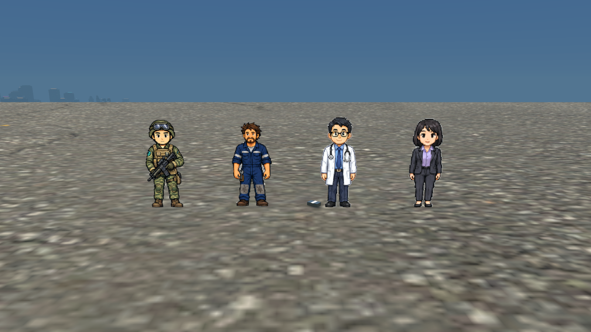
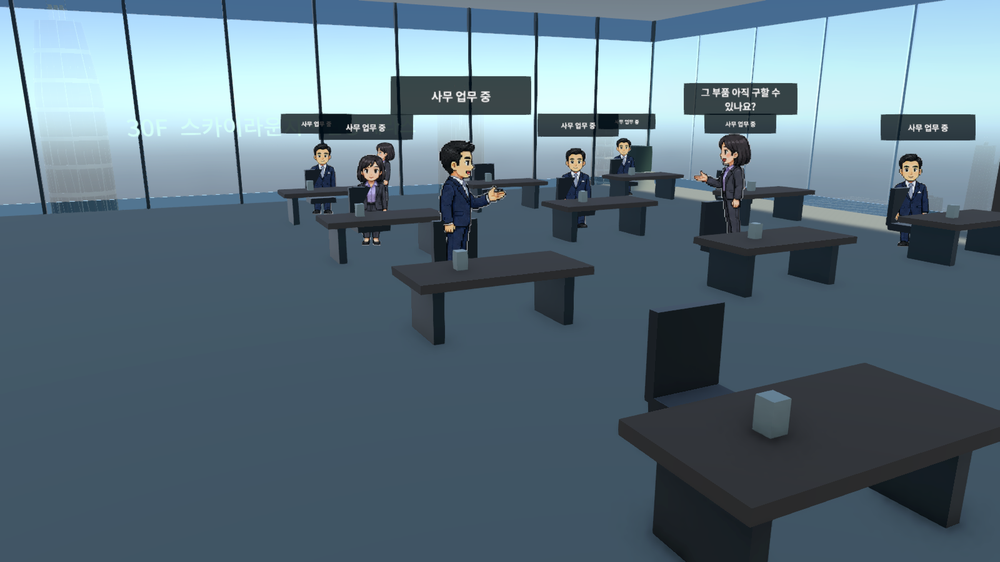
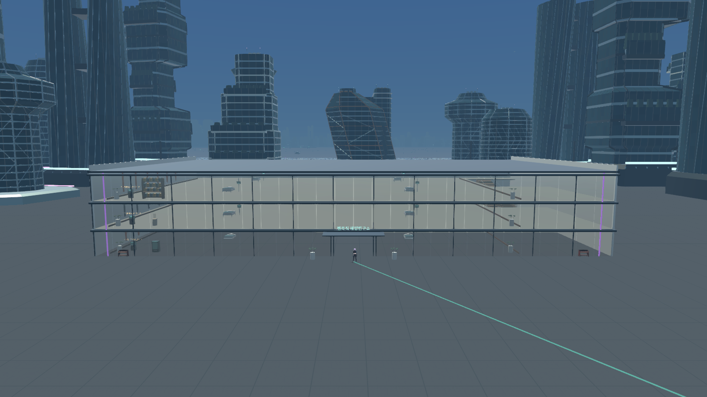
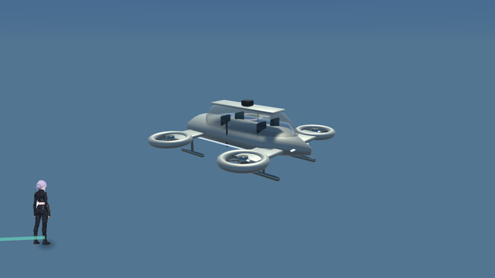
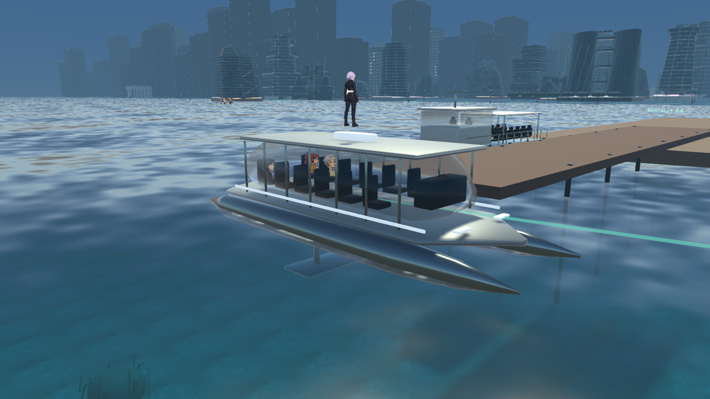

# NPC·고층 건물·도시 교통 수정

작업 시작 전에 전체 변경사항을 `2dc22dce`로 `main`에 커밋하고 GitHub에 푸시했다. 아래 후속 구현은 작업 트리에 적용되어 있으며 별도로 커밋하지 않았다.

## 적용한 내용

- NPC가 현재 층의 바닥을 짧은 상향 허용 범위로 찾는다. 위층 바닥을 잘못 선택하지 않으며, 지면 밑으로 밀리면 마지막 정상 지지점으로 복구한다. 앉기·눕기·차량 충격으로 날아가는 동작은 별도로 취급한다.
- 사망 직전의 스프라이트와 아틀라스 영역을 보관해 다른 시민의 사망 모습으로 바뀌지 않게 했다. 절단 마스크에도 같은 영역을 전달한다.
- 기존 주황색 작업자 외형은 교도소 수감자에만 배정한다. 일반 정비사는 새 남색 작업복을 사용한다. 군인은 새 전용 올리브색 위장복·헬멧·소총 스프라이트 16프레임을 사용한다. 확장 지역 48개 직업은 기존 4방향 도트 캐릭터 스타일로 통일한다.
- 열린 건물의 유리는 개별 판마다 체력·충돌·렌더링을 가진다. 근접 공격과 총격으로 깨지고, 깨진 판의 충돌도 제거된다. 일반 타워의 커튼월은 타격 위치별 파손 구멍과 해당 층 진입 상호작용을 제공한다. 타워의 큰 구조 충돌체를 실제 구멍 모양으로 재메시하는 방식은 아니며, 깨진 창문에서 **E**로 내부에 진입한다.
- 다층 시설 계단의 개별 단차 충돌을 연속 경사면으로 교체했다. 외형의 계단 디딤판과 난간은 유지한다.
- 차량 충돌 후 겹친 차체를 분리하며, 검사 여유 공간 때문에 실제로 겹치지 않아도 후진이 막히던 경우를 수정했다. 차량끼리 충돌하면 중량에 따른 밀림을 적용한다.
- 노바 해양연구소와 도로를 침범하던 공공시설을 옮겼다. 건물 배치 시 실제 도로 선분과 건물 면적을 비교하며 도로에서 물러난 위치를 선택한다. 지도 목적지 좌표도 이동한 입구에 맞춘다.

## 고층 건물

현재 도시에서 높이 30m 이상인 생성 타워 **424동**에 진입 상호작용을 제공한다. 각 건물은 높이에 따라 **10~30층**을 가지며, 승강기 메뉴를 5개 층씩 넘겨 모든 층을 선택한다. 승강기는 실제 높이로 이동하고 탑승자를 함께 운반한다. 승강기가 없는 층에서는 안전문이 닫혀 빈 승강로로 걸어 들어가지 않게 한다.

안내 로비, 사무·연구실, 회의 공간, 휴게 공간, 구내식당·스카이라운지 테마를 건물과 층에 따라 배정한다. 책상, 모니터, 의자, 선반, 커피 설비, 화장실, 칸막이와 직원 일과를 생성한다. 현재 층과 인접 층, 승강기 목적지까지 최대 4개 층을 유지하며, 해제한 층의 직원 체력·사망 상태를 보관한다. 상층에서는 실제 외부 도시가 보인다.

각 층을 수작업으로 모두 다른 사무실로 제작한 것은 아니다. 건물별·층별 테마와 배치를 조합하는 실내 생성 방식이다. 기존 저층 시설은 기존 실내 시스템을 계속 사용한다.

## 택시

- **블루웨이 수상택시 32대**: 쌍동선·수중익·유리 객실·승객 좌석. 항만과 노바 수로를 순환한다.
- **스카이라인 공중 무인택시 24대**: 4개의 덕트 팬·캡슐 객실·라이다·착륙 장치. 두 공항과 도시 상공을 순환한다. 운전자는 표시하지 않으며 무장은 없다.
- 정차 중 **E** 탑승: 수상 35 C, 공중 120 C. 승객 좌석에서 자동 이동하며 **C** 객실 시점, **F** 이동 중 하차를 사용한다.
- 수상택시가 다니는 기존 해안에 누락되어 있던 수면 메시를 복구했다. 노바 수면과 같은 파도·굴절·반사 셰이더를 사용한다.

모델 생성 원본은 `Tools/CityContinuity/create_taxis.py`, 배포 모델은 `Resources/WorldAssets/WaterTaxi`와 `AirTaxi`에 있다. 대중교통 승객 표시는 기존 객실 시스템을 사용한다. 택시는 지정 노선 운행이며 임의 목적지를 지정하는 호출 서비스는 아니다.

## 건축 참고와 제작

기존 8종의 건축 프로필을 원본 Blender 생성기에서 보강하고 FBX와 편집 가능한 `.blend`를 갱신했다. 직접 만든 형태이며 외부 건축 모델을 복제하거나 다운로드해 넣지 않았다.

- 비틀린 두 매스·중앙 아트리움·스카이브리지: [Zaha Hadid Architects, Leeza SOHO](https://www.zha.com/projects/architecture/leeza-soho?disclaimer=true).
- 층별 테라스·캔틸레버·식재와 공개 공간: [MVRDV, Valley](https://mvrdv.com/projects/233/valley?photo=21916).
- 타워 외벽에는 대각 구조재, 차양, 유리 난간과 정원층을 추가했다. 제작 원본은 `Tools/WorldExpansion/create_future_architecture.py` 및 `Documentation/FutureCity/Models`.

## 서하 3D — 미적용

Blender와 MPFB/MakeHuman으로 새 인체 토폴로지, 163개 뼈대·변형 가중치, 원본 일러스트를 반영한 의상 표면, 머리카락·칼라·부츠·장비의 입체 시안을 제작했다. **다섯 번 수정하고 정면·사선·후면 렌더링을 확인했지만 적용 기준에 미달했다.** 얼굴·머리의 측면 실루엣, 모발 볼륨, 의상 UV 경계, 팔·손의 표면 품질이 부족하다.

서하 3D 적용과 자연스러운 전체 3D 액션은 완료하지 못했다. 게임은 기존 스프라이트를 사용한다. 낮은 품질의 시안을 선택 가능한 완성 캐릭터처럼 배포하지 않는다.

제작 도구: `Tools/CityContinuity/create_seo_base.py`, `sculpt_seo.py`. 로컬 검수 원본: `Artifacts/CharacterLab/Seo-Anatomy.blend`, `Seo-Trial.blend`, `SeoTurnaround.png`, `Seo-Trial-Front.png`, `Seo-Trial-ThreeQuarter.png`, `Seo-Trial-Back.png`. 파일은 게임 리소스에 포함하지 않았다. 후속 제작에는 얼굴과 헤어를 독립적으로 조형하고 의상 토폴로지·UV·측면 텍스처를 다시 제작한 뒤 동작 변형을 검수해야 한다.

MPFB 플러그인은 `Artifacts/Tools/mpfb2`에 설치했다. 사용한 MakeHuman 코어 모델 자산은 CC0이고 도구 코드는 GPL이다. [MPFB 공식 모델 사용 안내](https://static.makehumancommunity.org/mpfb/faq/can_i_sell_models.html), [MakeHuman 라이선스](https://github.com/makehumancommunity/makehuman/blob/master/LICENSE.md). 검토만 한 MB-Lab과 Hunyuan3D의 모델·가중치는 배포 에셋에 사용하지 않았다.

## 검증과 정리

`PLAY.cmd`는 `Builds/CityContinuity/AFTERSIGNAL.exe`를 실행한다. 최종 Windows 빌드는 오류 0, 기존 경고 45, 1,698,526,015바이트로 성공했다. `CityContinuitySmoke`의 **17개 필수 네이티브 기능 확인이 모두 통과**했다. 택시 요금·승객석 탑승, NPC 지면 복구·사망 외형, 차량 후진 탈출, 실제 계단 한 층 통과, 30층 승강기 동반 이동, 유리 파손과 수면 복구를 포함한다. 보고서는 `essential.json`, 원래 실행 로그와 화면은 `Artifacts/CityContinuity/Final`에 있다. 각 건물의 모든 층을 장시간 수동 플레이한 검증은 아니다.

GUID 참조 조사에서 이전 생성 메시 1,923개, 507,980,278바이트가 미사용으로 확인되었다. 일괄 삭제 명령은 자동 승인 검토에서 `blocked by policy`로 거부되어 삭제하지 않았다. 목록은 `Artifacts/unused-generated-meshes.json`이다. 이 문서의 파일 정리는 삭제 완료 보고가 아니다.

