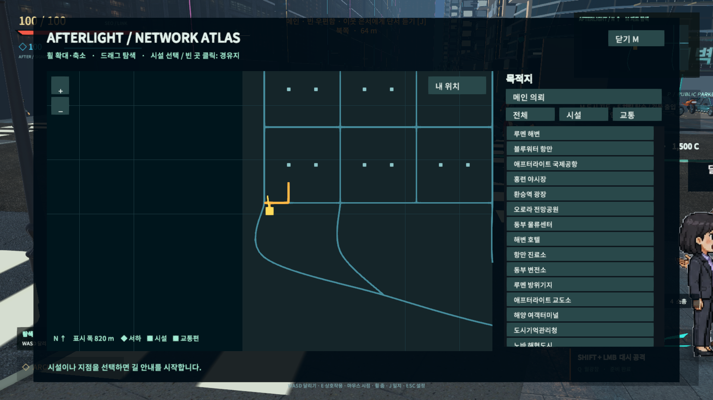
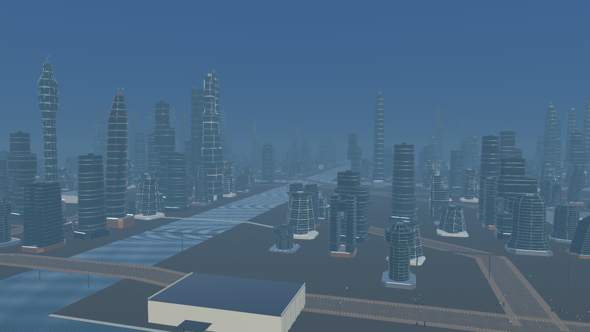
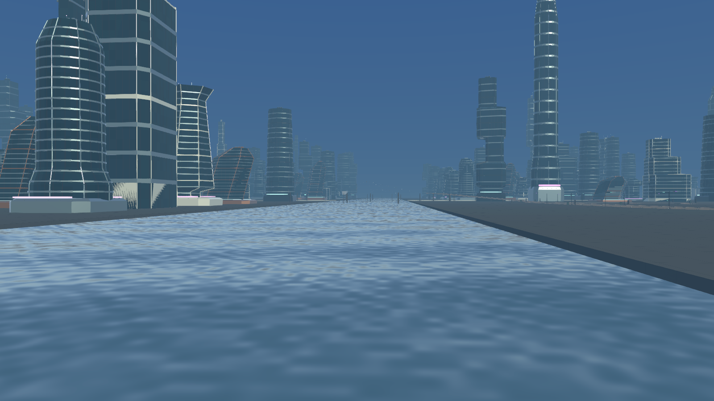
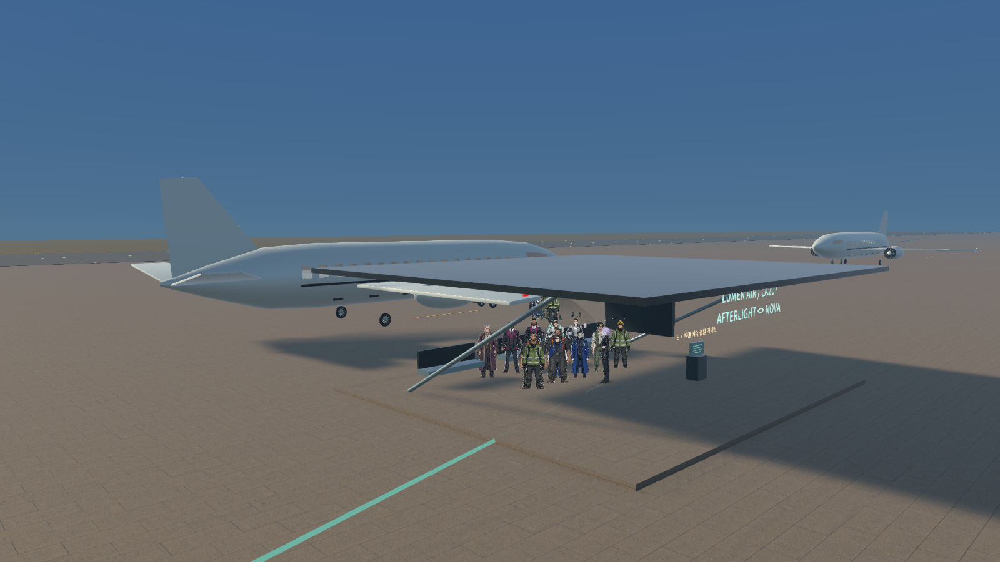

# 도시 교통·건축 개선

이번 작업 시작 전의 변경사항은 `270c1e30`으로 main 브랜치에 커밋·푸시했습니다. 이 문서의 후속 구현은 작업 트리에 적용됩니다.

## 조작

- **M**: 현재 위치 중심 지도. **휠**로 확대·축소, **드래그**로 탐색. **내 위치**로 복귀.
- 지도 시설·목적지 목록을 선택하면 길 안내. 빈 곳을 클릭하면 임의 경유지 지정.
- 공항·여객항 서비스 단말에서 운행 상황과 탑승구 안내. 게이트 교통편 옆 **G**로 항공권 240 C / 승선권 80 C 구매.
- 모든 운전·승객 좌석에서 **F**로 이동 중 탈출. 일반 차량은 **E**도 가능. 버스 **E**는 기존 하차벨, **F**는 즉시 뛰어내리기.
- 뛰어내린 서하는 탈것의 속도를 이어받습니다. 조종자를 잃은 차량은 감속하고 항공기는 하강합니다.

## 구현

지도 도로·시설·경로·교통편 위치는 같은 지도 변환을 사용합니다. 미니맵도 주변을 확대해 표시합니다. 두 공항의 항공편과 두 여객항 사이의 여객선은 실제 좌표를 따라 운행합니다. 각 승객은 고유 NPC로서 터미널에서 이동하고, 객실 좌석에 동일한 외형으로 표시되며, 도착 도시에서 내립니다. 항공편은 활주·이륙·순항·접근·착륙·게이트 이동 단계를 거칩니다.

가로등·나무는 충돌 에너지에 따라 차량이 손상되거나 쓰러집니다. 중량이 큰 전차는 일반 차와 결과가 다릅니다. 고속 항공기 충돌 시 건물 붕괴, 먼지, 연쇄 폭발과 잔해를 표시합니다. 새 건축물은 독립된 충돌·렌더링 단위를 사용하며 기존 건물 배치에는 충돌 지점의 메시를 잘라내는 호환 처리를 적용합니다.

Blender로 8가지 건축 실루엣(Helix, Cascade, Prism, Oval, Cantilever, Lantern, TwinGate, Orbital), 가까운/먼 거리 모델과 충돌 형상을 제작했습니다. 기존 시내 상층부, 해안 지역과 노바의 일반 타워에 적용합니다. 세단·스포츠카·바이크·버스·트럭은 기존 좌석과 바퀴 위치를 유지하면서 미래형 차체, 패널, 통풍구, 휠 커버와 조명을 적용했습니다.

바다에는 깊이에 따른 광 흡수, 화면의 불투명 물체를 이용한 굴절, 환경 반사, 파도·잔물결의 표면 법선, 태양 반짝임과 해안 거품을 사용합니다. 화면 밖 도시를 추적하는 광선 추적 반사는 아닙니다.

최적화: 구역 주민을 근거리부터 생성하고 멀어진 구역의 생존·체력 상태를 보관 후 해제합니다. 건물 메시를 재사용하고 거리별 LOD를 적용합니다. 멀리 있는 차량의 객실 스프라이트 갱신 주기를 줄이며, 차량 충돌 검사에서 매 프레임 배열 생성을 제거했습니다. 모든 직렬화 에셋의 GUID 참조를 조사해 미사용 생성 메시 9,914개와 메타 파일(2,817,904,258바이트)을 제거했습니다. 재검사 도구는 `Tools/WorldExpansion/audit_unused_meshes.py`이며 파일 삭제를 수행하지 않는 읽기 전용 도구입니다.

## 제작 도구

- Blender 4.5.3 LTS: 기존 설치를 사용. `Artifacts/Tools/blender-4.5.3-windows-x64/blender.exe`
- Material Maker 1.7: 공식 GitHub 릴리스의 Windows 포터블 배포본 설치. `Artifacts/Tools/MaterialMaker-1.7/material_maker_1_7_windows/material_maker.exe`
- 실행: 루트 `ART-TOOLS.cmd`. Material Maker 재설치: `Tools/Install-Art-Tools.ps1`.
- Blender 원본: `Documentation/FutureCity/Models` 및 `Documentation/Mobility/Models/Future*.blend`.
- 재생성: `Tools/WorldExpansion/create_future_architecture.py`, `create_future_vehicles.py`를 Blender 백그라운드 모드로 실행.

공식 문서: https://www.blender.org/releases/4-5/ · https://www.materialmaker.org/ · https://github.com/RodZill4/material-maker/releases/tag/1.7

Material Maker archive SHA-256: `DEB4416BC939861D48097A866A8B2BF0363C29FF64874F2E04478658FF900808`.

## 범위

건축·차량 형상과 렌더링을 개선한 버전이며, 상용 대작의 수작업 환경 아트·시뮬레이션 전체를 재현한 것은 아닙니다. 교통편은 지정 노선을 운항하며, 구조물 붕괴는 게임용 단계 연출입니다. 기존 실내 기능과 BGM은 유지됩니다.

## 실행과 필수 확인

`PLAY.cmd`는 최신 Windows 실행 파일 `Builds/FutureCity/AFTERSIGNAL.exe`를 실행합니다. 빌드 성공: 오류 0, 경고 45, 1,578,487,586바이트. 기능 확인 15개(`essential-gameplay.json`)와 마지막 지도·수면 화면 확인 5개(`essential-presentation.json`)가 통과했습니다. 전자는 실제 항공편·여객선의 승하차와 도착을 기다린 결과이며, 화면 수정 후에는 관련 확인만 반복했습니다.

공항의 90프레임 구간은 평균 16.53ms였습니다. 도시 전역의 최저 프레임률이나 모든 장시간 플레이 상황을 검사한 수치는 아닙니다. 초기 빌드의 도시 로딩 오류는 저장 컴포넌트의 파일 분리와 GUID 참조 복구로 해결했고, 수정된 실행 파일에서 도시 진입을 확인했습니다.

