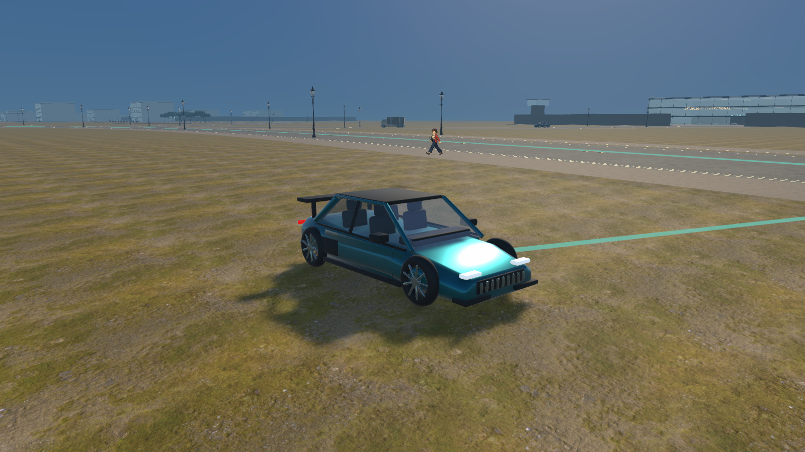
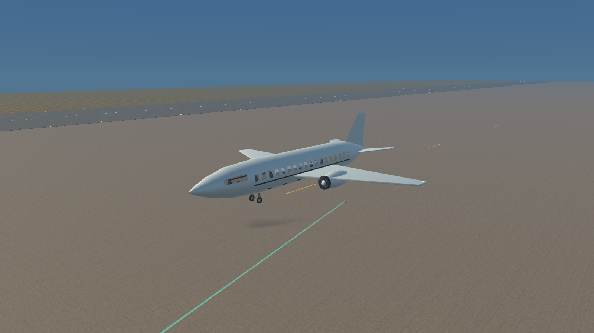
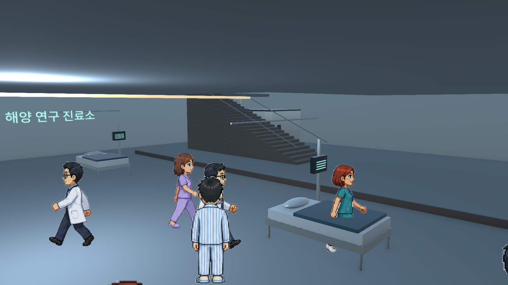
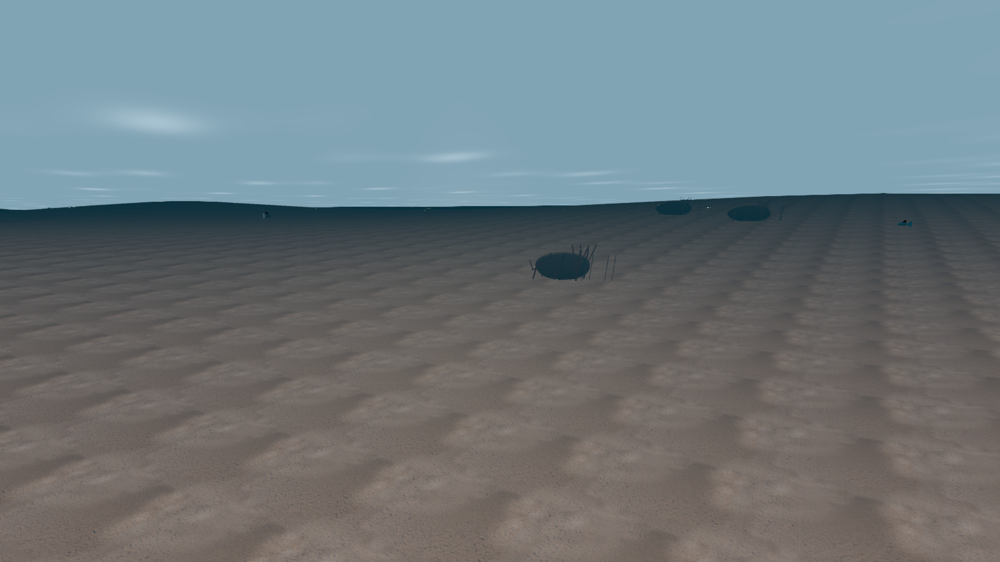

# 교통 · 해양 · 외곽 시설 업데이트

## 적용 범위

- 지면 탐색에서 자기 차량·다른 차량·물리 파편을 제외했다. 일반 차량은 연석 높이까지만 지면을 따라 올라간다. 기존 저장 차량도 시작할 때 실제 지면에 정렬한다.
- Blender FBX의 앞뒤 축 반전을 바로잡아 차체 앞, 운전 방향, 운전석 위치를 일치시켰다. 바퀴는 차축을 기준으로 구르고 앞바퀴는 조향한다. 전조등은 흰색, 후미등은 붉은색이다.
- 기존 지역의 8개 진출입 연결 경로를 추가했다. 이전 외곽을 막던 배경 타워 41동을 제거하고 기존 도시 장면의 시각 배치를 다시 묶었다.
- 바이크·스포츠카·여객선·여객기·전투헬기·전투기·전차의 원본 Blender 모델과 Unity FBX를 추가했다. 군용 차량에는 무장을 연결했다.
- 기존 공항의 비행기 4대도 조종 가능한 차량으로 전환했다. 기존 대형 컨테이너선은 원래 모델을 유지하면서 독립적으로 운항한다. 항공기·선박에는 NPC 운항편과 승객석이 있다.
- 확장 지역에 직접 걸어서 출입하는 건물 24동, 군부대 건물 3동, 교도소 교정동, 여객터미널을 추가했다. 승강기 29기와 계단으로 2–4층을 연결한다. 공동주택·사무실·카페·작업장·진료실·병영의 가구와 시설을 구분했다.
- 기존 실내에는 가구 하드웨어, 병상 모니터, 걸레받이·벽 보호대, 천장 조명·흡음 마감, 교실 화면과 본부 영상 벽을 보강했다.
- 새 지역 NPC 등록 인원은 891명이며 주변 210m 내 인물만 활성화한다. 실내 배역은 의사·간호사·환자, 바리스타·손님, 회사원·주민, 군인·정비병 등으로 구분한다.
- 주변 일반 교통 차량 상한을 14대에서 48대로 확대했다. 주차장 45곳, 주차 구획 276면을 배치하고 근처에서 주차 차량을 생성한다. 플레이어가 가져간 차는 즉시 재생성하지 않는다.
- 해저 지형·산호·해초 군락 115곳과 물고기·거북·가오리 180마리를 추가했다. 수영·잠수 시 기존 낙하 사망 규칙을 적용하지 않는다.
- 수배 중 경찰 근처에서 투항하거나 체포되면 실제 교도소 수감실로 이동한다. 형기 종료 또는 보석금 납부로 출소한다.
- 발소리 믹스 게인을 0.65에서 0.17로 낮췄다. BGM과 다른 효과음 볼륨은 이 조정의 대상이 아니다.
- 여객기 창문은 개별 개구부와 창틀로 구분했다. 차량 유리는 내부 인물을 볼 수 있는 착색 유리이며 스포츠카에는 문 패널·손잡이·필러·사이드 스커트를 보강했다. 가까운 NPC 말풍선은 화면상의 최대 폭을 제한한다.
- 배경 재배치 후 참조가 사라진 생성 메시 1,783개(원본 약 1,379 MiB)를 제거했다. 장면·프리팹·재질·기타 직렬화 에셋의 GUID 참조와 런타임 로딩 경로를 확인한 대상만 정리했다. 대형 화물선은 표시용 메시 8개와 충돌체 3개로 묶었다.

## 조작

| 상황 | 조작 |
| --- | --- |
| 차량 운전석 / 항공기 조종석 / 선장석 | 가까이에서 E |
| 조수석·뒷좌석·승객석 | 가까이에서 G |
| 지상 차량 운전 | W/S 전진·후진, A/D 조향, Shift 가속, Space 제동 |
| 항공기 | W/S 추력, A/D 선회, Space 상승, Ctrl 하강, Shift 가속 |
| 고정익 이륙 | 활주로에서 W로 충분히 가속한 뒤 Space |
| 선박 | W/S 추진·후진, A/D 방향타, Shift 가속, Space 제동 |
| 전차·전투기·전투헬기 무장 | 마우스로 조준 후 왼쪽 클릭 |
| 하차·하선 | 정차 후 E 또는 F, 항공기는 착륙 후 F |
| 수영·잠수 | WASD 이동, Space 위로, Ctrl 아래로, Shift 빠르게 |
| 다층 승강기 | 승강기 호출 E, 탑승 후 E로 이동할 층 선택 |
| 투항 | 수배 중 경찰 8m 이내에서 H를 1.4초간 누르기 |
| 교도소 | 수감실에서 E로 안내·보석금 450 C, 또는 형기 대기 |

## 위치

M 지도에서 군부대·교도소·해양 여객터미널을 선택할 수 있다.

- 시작 차량 구역: 스포츠카와 바이크 (78~83, -254)
- 군부대 진입로: (420, 720). 전투헬기는 H 패드 (435, 842), 전투기는 활주로 (300, 900), 전차는 정비구역 앞 (340, 777).
- 공항: 여객기 대여·NPC 비행편은 (1400~1480, 800), 기존 A1~A4 계류장도 탑승 가능.
- 해양 여객터미널: (1250, -673). 서쪽 부두는 직접 조종하는 배, 동쪽 부두는 NPC 운항편.
- 대형 화물선: 기존 항만 안벽 (1730, -554)에서 정박 중 승선.
- 해저 탐색: 해변에서 바다로 들어가 Ctrl로 잠수.

## 제작 자료와 구현 방식

`Models`에 7종의 Blender 원본을 보관한다. `Tools/WorldExpansion/create_transport.py`로 다시 내보낼 수 있다. 차량은 세밀한 외형을 갖춘 자체 제작 메시와 게임용 단순 충돌체를 사용한다. 지상 차량·항공기·선박의 조작은 물리 시뮬레이터 수준의 모델이 아닌 게임용 조작 모델이다. NPC 항공·선박 운항은 지정된 순환 노선과 대기 시간을 따른다.

건물은 실내 탐색이 가능한 모듈 조합으로 제작한 이번 확장 버전이다. 각 건물마다 독자적인 상용 게임 수준의 미술 제작을 끝낸 상태라는 의미는 아니다. 기존 캠페인·AI 대화·BGM 설정은 유지한다.

## 필수 검증

실제 Windows 플레이어에서 필수 기능 19개를 통과했다. 지면 상승 재현 500회, 앞뒤 표시와 바퀴 축, 좌석별 입력, Shift 속도 차이, 전투기·헬기 이륙, 여객선 추진, NPC 운항과 승객, 승강기 운반, 잠수·해저 충돌, 교도소 수감·출소를 확인했다. 보고서는 `Artifacts/Mobility/Final/mobility.json`에 있다.

그 이후 변경은 차량 창틀·유리·말풍선 표시와 미사용 생성 메시 정리다. 최종 빌드에서 지역·교통 리소스 로딩 3개와 7개 실제 화면을 별도로 확인했으며 런타임 오류가 없었다. 전 캠페인 회귀 검증이나 장시간 성능 검증은 반복하지 않았다.

최종 Windows 빌드: 성공, 오류 0개, 기존 obsolete API/URP 관련 경고 42개, 1,905,528,799 bytes. 빌드 로그: `Artifacts/WorldExpansion/mobility-final-release.log`. 최종 화면 실행 로그: `Artifacts/Mobility/presentation-player.log`. 이 폴더의 `functional-checks.json`, `presentation-checks.json`과 PNG가 확인 자료다.

`PLAY.cmd`는 `Builds/MobilityRelease/AFTERSIGNAL.exe`를 실행한다.

## 실제 게임 화면

