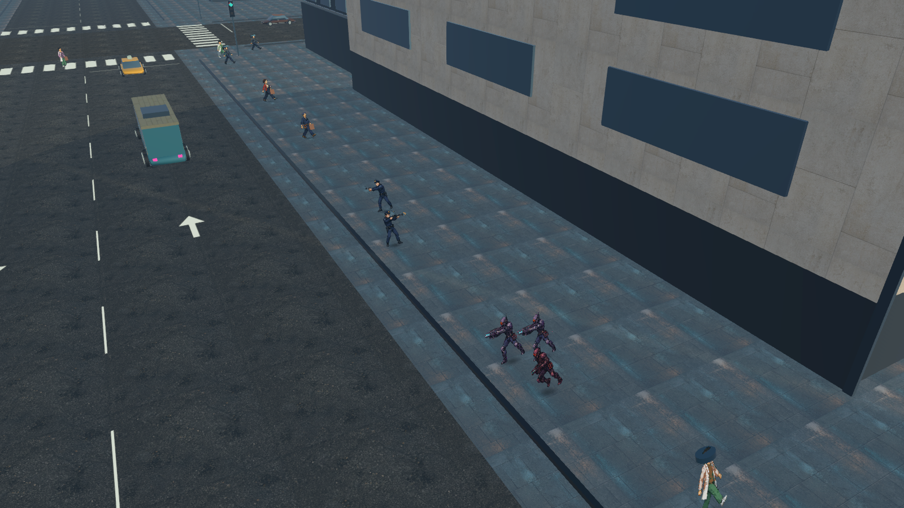

# 도시 갱단과 경찰 교전

도시 외부 `UrbanCity`의 12개 거리 구역에서 갱단과 순찰 경찰이 등장해 서로 발견하면 교전한다. 플레이어 수배가 없어도 동작한다. 갱단은 적철단·바이올렛 크루·녹슨 송곳니의 세 색상 계열이며 기존 무장 적 스프라이트를 활용한다. 경찰은 별도로 제작한 경찰 전용 스프라이트를 사용한다.

- 한 구역에 갱단 3명, 순찰 경찰 2명(권총·샷건)을 배치한다. 근처 최대 3개 구역, 총 15명으로 제한한다.
- 플레이어에서 32~210m 떨어진 가까운 구역을 우선 활성화한다. 첫 도시 화면을 표시하기 전에 초기 개체를 채우고, 이후 재등장은 화면 밖에서만 한다. 바닥/벽 충돌이 있는 위치에는 생성하지 않는다.
- 경찰과 갱단은 시야에 들어온 상대를 선택해 접근, 조준, 사격, 피격, 쓰러짐을 수행한다. 총탄은 실제 충돌체에 맞으며 벽과 같은 편 캐릭터가 사선을 막는다.
- 갱단은 먼저 경찰과 싸우고, 플레이어가 공격하면 25초 동안 플레이어에게도 반격한다. 갱단을 공격한 것만으로 플레이어를 수배하지 않는다. 시민·경찰에 대한 플레이어 공격은 기존 수배 규칙을 따른다.
- 경찰은 수배 중인 플레이어와 갱단 중 위협을 선택한다. 거리의 순찰 경찰도 플레이어를 발견하면 기존 수배 시스템의 목격으로 반영한다.
- NPC끼리의 피해에는 공격자를 명시하므로 플레이어의 수배 점수를 올리지 않는다. 순찰 경찰은 플레이어 수배 출동 인원과 별도로 관리한다.
- 교전이 끝나거나 플레이어가 멀리 이동하면 화면 밖 구역을 정리한다. 정리된 구역은 120초 후 다시 등장할 수 있다. 시체는 12초 후 제거한다. 씬 이동 시 해당 구역의 모든 개체를 함께 정리한다.

## 코드

- `CityGangWar`: 구역, 생성 위치, 활성 개체 제한과 재등장.
- `GangMember`: 갱단 표적 선택, 접근, 사격, 플레이어 공격에 대한 반격.
- `PoliceOfficer`: 전용 경찰 동작과 갱단/수배 플레이어 표적 선택.
- `FactionCombat`: 공통 시야·총탄 충돌·진영별 피해 규칙.
- `WorldActor.Damage(..., source)`: NPC 피해와 플레이어 피해 귀속 분리. 기존 플레이어 무기·차량 호출은 유지한다.

## 필수 확인

명시적 실행 옵션 `-gang-war-smoke`가 실제 도시에서 구역 생성, 양측 사격/피해/제압, 방관자의 수배·체력 유지, 벽과 같은 편의 사선 차단, 경찰 공격 시 수배 유지 여부를 확인한다. 검사 실행은 생활 저장을 비활성화하며 전체 캠페인 검사를 반복하지 않는다. 로그와 결과는 `Artifacts/GangWar`에 기록한다.

2026-09-07 최종 Windows Release 빌드 성공(오류 0, 기존 경고 35). 실제 도시에서 갱단 25회·경찰 16회 사격을 관찰했고 상호 피해와 제압을 포함한 필수 확인 12개가 통과했다. `Artifacts/GangWar/Release/gang-war.json`의 `completed=true`, 오류 목록은 비어 있다. 최종 빌드 로그는 `Artifacts/GangWar/build-final.log`이다. 최대 세 구역 장시간 부하 검사나 전체 캠페인 회귀는 반복하지 않았다.

