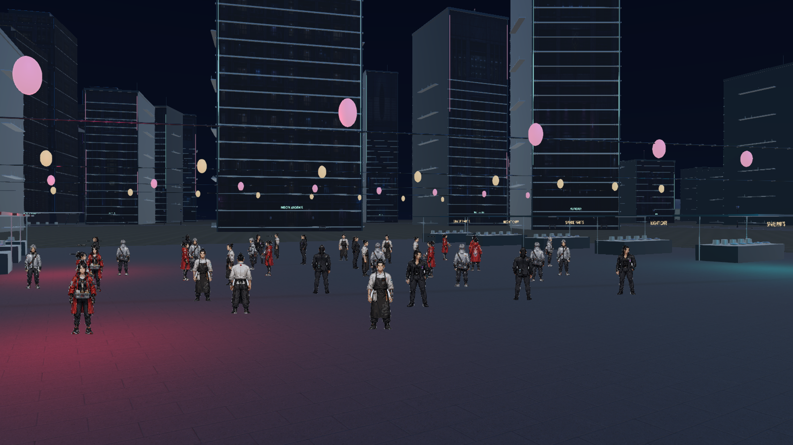
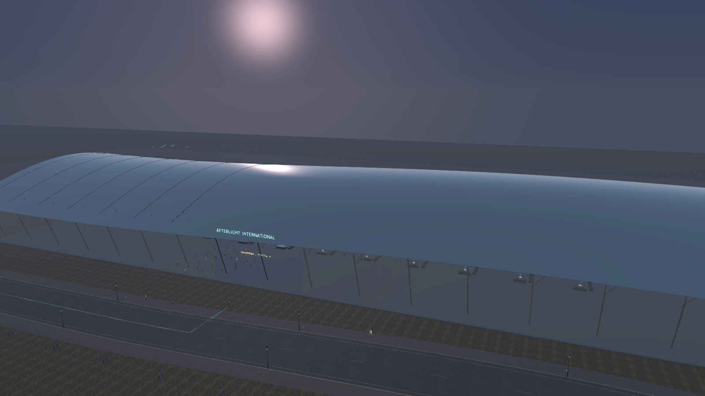
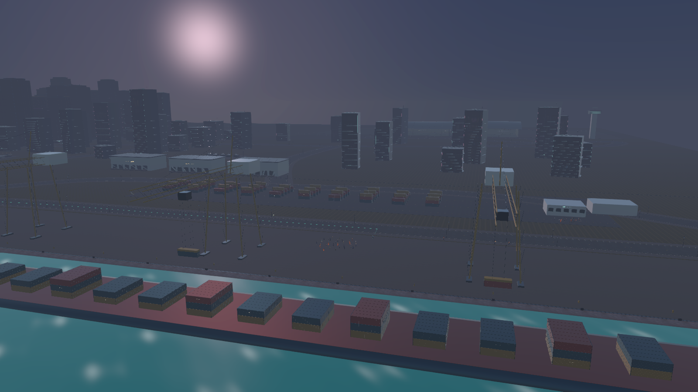

# 애프터라이트 해안 확장 · 2026-09-08

`PLAY.cmd`는 `Builds/active-player.txt`가 가리키는 Windows 실행 파일을 시작합니다. 시내에서 **M**으로 지도를 열고 오른쪽 위의 새 목적지를 선택하세요. 시설 안내 지점 근처에서 **E**로 서비스를 이용합니다. 환승역 광장에서는 공항·해변·항만으로 유료 이동할 수 있습니다.

## 이번 변경

- 서하 전용 3D 시험 모델, 리깅, 런타임 연결, 제작 스크립트와 전용 빌드를 프로젝트에서 철회했습니다. 서하는 기존 8방향 스프라이트를 사용합니다. 철회한 원본은 저장소 밖 `../AFTERSIGNAL-Withdrawn/Seo3D-20260908`에 보관했습니다.
- 차량 폭발에 순간 섬광, 불덩이, 검은 연기, 먼지, 불꽃, 후속 연소를 적용했습니다. 실제 차량 메시를 나누어 바퀴·차체 파편을 날리고 약 8초 안에 정리합니다. 기존 탑승자 방출과 연동합니다.
- 고속 차량 충돌 시 충돌 방향과 속도에 따라 시민이 위로, 멀리 날아갑니다. 지면과 벽에 닿으면 튕기거나 멈춥니다.
- 경찰 헬기는 체력이 소진되면 회전하며 중력으로 추락합니다. 추락 경로를 검사해 지면이나 건물과 충돌한 위치에서 폭발하고 파편을 방출합니다.
- 총기 조준과 총구 사격의 충돌 필터를 통일하고 최대 사거리를 1,400m로 늘렸습니다. 화면 중앙 조준점의 표적을 향해 발사하며, 총구 앞의 실제 벽은 탄환을 막습니다.
- 기존 실제 권총 발사 녹음은 유지하고, 장전은 녹음된 탄창 분리·삽입·슬라이드 조작 소리로 교체했습니다.
- 일부 성인 시민은 공격자를 쫓아가 반격합니다. 시민별 반격 자격, 추적 시간, 공격 간격을 둡니다. 고정 퀘스트 인물과 보호 대상은 제외합니다.
- 카타나·블레이드의 치명타에는 62% 확률로 머리·팔·다리 영역 중 하나를 분리하는 스프라이트 연출을 적용했습니다. 본체의 동일 영역은 가리고, 분리된 부분에는 낙하 움직임을 적용합니다.
- 직업·장소·시간·피격·위험·폭발·인사·상호 대화를 위한 대사 은행은 340개 항목입니다. 이 중 40개는 두 NPC가 주고받는 대화입니다. 같은 상황의 직전 대사를 바로 반복하지 않도록 했습니다.

## 지도와 시설

기존 시내 중심부를 보존하면서 동쪽·남쪽·북쪽으로 확장했습니다. 이동 범위의 폭은 2,200m이고, 곡선 해안도로·대각선 연결도로·공항 순환도로·공원 순환로를 추가했습니다. 교통 차량과 보행자, 지도 경로, 경찰 출동 위치도 확장 좌표를 사용합니다.

| 목적지 | 공간과 이용 기능 |
|---|---|
| 루멘 해변 | 해변, 산책로, 파라솔·선베드, 구조대 초소, 낚시 부두, 매점과 정화 활동 |
| 블루워터 항만 | 컨테이너 야드, 갠트리 크레인, 대형 컨테이너선, 철도, 세관, 화물 검수 근무 |
| 애프터라이트 국제공항 | 출입 가능한 터미널 홀, 체크인·수하물 시설, 탑승교, 항공기 4대, 활주로·관제탑, 카페·분류 근무 |
| 홍련 야시장 | 비스듬한 골목 배치, 노점, 조명 케이블, 식사·야간 근무 |
| 환승역 광장 | 승차권 게이트·공공 광장, 공항·항만·해변 유료 셔틀 |
| 오로라 전망공원 | 도시를 바라보는 산책·휴식 공간 |
| 동부 물류센터 | 창고, 하역 도크, 화물 검수·구내식당 |
| 해변 호텔 | 발코니 외관·수영장, 숙박·조식 |
| 항만 진료소 | 항만 의료 시설, 치료·의료물자 정리 |
| 동부 변전소 | 변압기·애자·전력 설비, 점검 보조 근무 |

시설 전용 NPC는 **24종 × 4방향 = 96프레임**, 배치는 **344명**입니다. 기장, 승무원, 조업원, 보안 요원, 여행객, 하역원, 선원, 세관원, 구조대원, 서퍼, 어부, 상인, 배달원, 경호원, 역무원, 정비사, 미화원, 구급대원 등을 포함합니다. 플레이어 주변의 주민을 활성화해 이동·대화·피격과 연결합니다. AI 대화는 기존 `CityNpc` 연결을 재사용하며, 직업과 현재 시설을 대화 배경에 전달합니다.

## 제작과 출처

- 독자 제작한 세단 원본: `DetailedSedan.blend`. 차체 곡면, 창틀, 도어 이음매, 손잡이, 미러, 조명, 그릴, 좌석, 타이어·휠을 제작했습니다. `Tools/WorldExpansion/create_vehicle.py`로 재생성합니다. 세단과 택시에 적용하고 기존 탑승자·도색·경찰 장식을 유지합니다. 버스 등 대형 차량에는 미러·패널·환기구·등화 세부를 추가했습니다.
- 가로등·벽등·벤치·도로 방호벽·건물 창호는 [Poly Haven](https://polyhaven.com/license)의 CC0 자산을 사용합니다. 원본 다운로드 URL과 해시는 `polyhaven-sources.json`에 있습니다.
- 아스팔트·모래·잔디와 돌·콘크리트의 CC0 표면은 `surface-sources.json`에 기록했습니다. 물리 크기에 맞춘 반복 UV와 노멀 맵을 사용합니다.
- 신규 시민 원화는 내장 이미지 생성 도구로 제작했습니다. 원본 경로와 프롬프트는 `npc-prompts.json`, 게임용 이미지는 `Resources/Art/FacilityCitizens/`에 있습니다.
- 장전 소리 출처는 [SpringySpringo의 Gun Reload Sounds](https://opengameart.org/content/gun-reload-sounds), CC0입니다. 에어소프트 탄창·조작부를 녹음한 소리이며 실총 발사 녹음과 구분합니다. 편집 구간과 해시는 `reload-sources.json`에 있습니다. 권총 발사 소리의 기존 출처는 `../Audio/FIREARM-LICENSE.txt`에 있습니다.

공항의 여객·수하물·조업 구역 분리는 [창이공항 안내도](https://www.changiairport.com/content/dam/cag/airport-guide/airport-guide-download/lowres/july-oct-2019/CAG%20AG_English_LoRes.pdf), 항만의 야드·크레인·철도 연결은 [로테르담항 사진 자료](https://www.portofrotterdam.com/nl/perskamer/fotogalerij)와 [철도 야드 자료](https://www.portofrotterdam.com/sites/default/files/2024-03/construction-of-the-maasvlakte-zuid-rail-yard.pdf)를 참고했습니다. 용도별 구역과 네온·산업 시설의 대비는 [Cyberpunk 2077 공식 소개](https://www.cyberpunk.net/us/en/cyberpunk-2077)를 참고했습니다. 게임의 지도·모델·텍스처를 추출하거나 복제하지 않았습니다.

## 구현 범위

이 확장은 직접 돌아다니며 전투·대화·시설 이용을 할 수 있는 게임용 구현입니다. 상용 대형 오픈월드 게임 수준의 최종 환경 아트라고 보장하지 않습니다. 중심부의 기존 격자 도로는 유지되고 새 외곽 구역에 다양한 구조를 더했습니다. 항공기와 대형 선박은 시설 배경 모델이며 운항 시뮬레이션은 없습니다. 호텔·창고 등 모든 신축 건물에 개별 실내를 만든 것은 아닙니다. 셔틀과 시설 근무는 기존 메뉴·시간 경과 시스템을 사용합니다. 시민 분리 연출은 2D 스프라이트 기반이며 3D 인체 해부·래그돌 시스템이 아닙니다.

## 재생성과 필수 확인

Unity 메뉴 `AFTERSIGNAL > World > Build coastal expansion`에서 확장 프리팹을 다시 만듭니다. 명령줄의 `AfterSignal.Editor.WorldExpansionBuilder.BuildAndRelease`는 이 작업 후 Windows 플레이어를 빌드합니다. 기존 캠페인 장면은 재생성하지 않습니다.

필수 네이티브 확인은 `-world-expansion-smoke -quality-output <출력 폴더>`로 실행합니다. 실제 총격·충돌·격추·주민 활성화·96개 방향 프레임·지도 연결·시설 지면을 확인하고 실제 게임 카메라 이미지를 저장합니다. 결과는 `world-expansion.json`에 기록합니다. 전체 캠페인 재검증과 장시간 성능 측정은 이번 범위에 포함하지 않았습니다.

최종 확인 결과: 기능 32항목 통과, 런타임 오류 0. 네온 강도와 진단 카메라 대기 처리 수정 후에는 기존 기능 검증을 반복하지 않고 5개 구역 화면을 추가 확인했으며 오류는 없었습니다. Windows 빌드 오류 0, 기존 obsolete API/URP 관련 경고 40개입니다. 기능 결과 사본은 [verification.json](verification.json), 원본 로그와 추가 화면은 `Artifacts/WorldExpansion/`에 있습니다.

## 실제 실행 화면

