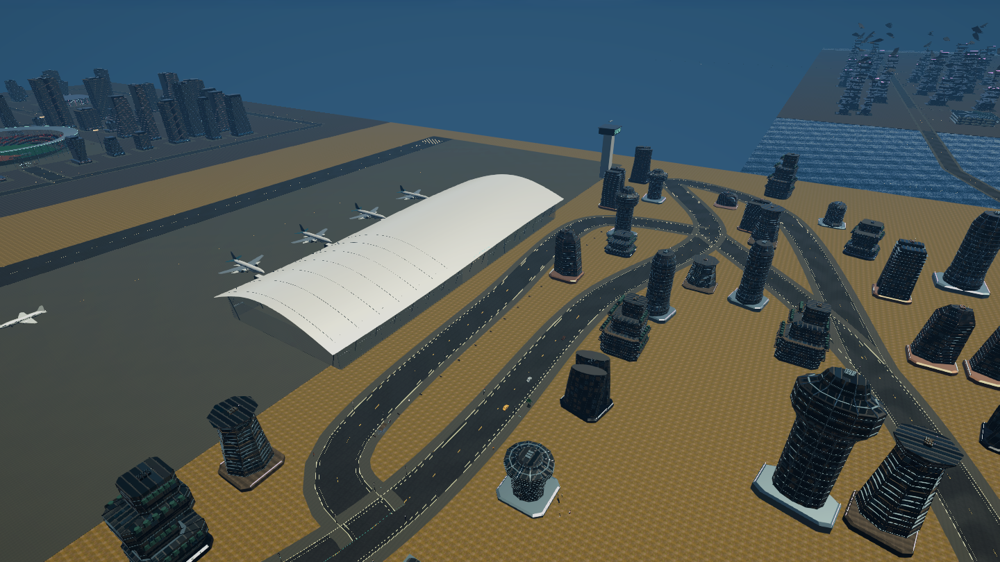
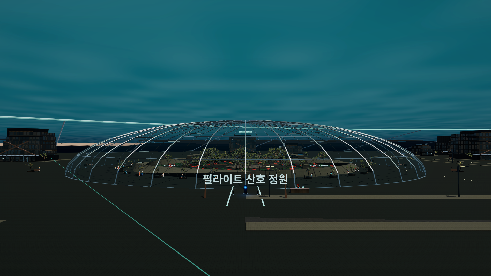

# 지면·시설 복구와 돔 반사 수정 — 2026-09-08

`PLAY.cmd`는 `Builds/WorldRecovery/AFTERSIGNAL.exe`를 실행한다. 이미 실행 중인 이전 플레이어에는 변경이 적용되지 않으므로 종료 후 다시 실행한다.

## 확인된 누락 원인과 복구

`AfterlightExpansion.prefab`의 `Batched district geometry` 자식이 비어 있었다. 도로·지면·공항의 충돌 객체는 남아 있지만 이를 그리는 **691개 배치 객체**가 없었다. 동일 공항 좌표의 Windows 플레이어에서도 누락을 재현했고, 카메라 투명 처리 해제·LOD 강제 표시·표준 재질 교체로는 복구되지 않았다.

정상 데이터가 남아 있는 `2dc22dce`에서 배치 하위 트리만 복원했다. 최신 게임플레이·충돌·시설 수정은 유지했다. 복원한 컴포넌트 3,455개가 참조하는 에셋 GUID 715개가 모두 존재한다. `Tools/Fidelity/restore_coastal_batches.py`는 복구한 영역이 다시 덮어써지지 않도록 이미 채워진 트리에서는 중단한다. 어떤 편집 작업이 배치를 제거했는지는 확정하지 않았다.

빌드 전 다섯 월드 프리팹의 배치·메시 의존성을 확인하고, 렌더링 데이터가 없는 빌드는 실패시킨다. 원본 메시 정리 단계도 배치가 존재할 때만 실행하며 배치 내부를 정리 대상에서 제외한다.

## 수중 도시·유리·거리 표시

- 기밀 돔과 온실에 얇은 유리 전용 셰이더를 적용했다. 반사 밝기와 투명도를 제한하고 불투명 재질의 강한 반사광을 사용하지 않는다. 양면 렌더링에 더해 역방향 삼각형까지 중복 생성하던 부분을 제거했다.
- 블룸 입력 상한을 6으로 지정하고 번짐 범위를 줄였다. 발광하지 않는 일반 창문이나 효과 재질을 이름만으로 야간 발광 재질로 바꾸지 않는다.
- 거리별 표시 여부는 건물 원점 대신 전체 경계와 플레이어·카메라의 거리를 사용한다. 항공 시점에서는 표시 거리를 늘리고 경계에 여유 거리를 둔다.
- 거리 최적화는 `forceRenderingOff`만 제어한다. 붕괴·실내 출입·LOD가 사용하는 `enabled` 값을 덮어쓰지 않는다. 표시 상태가 달라질 때만 갱신한다.
- 카메라 투명 처리가 거대한 통합 배치나 발밑 바닥 전체를 숨기지 않도록 제외 조건을 추가했다. 투명 상태가 유지되는 동안 재질 배열을 반복 교체하지 않는다.

첨부 화면의 거대한 흰 번짐은 검사 좌표에서 똑같이 재현하지 못했다. 위 수정은 위험한 반사·발광 경로를 제한한 것이며, 정확한 발생 조건을 확정했다고 보고하지 않는다. 수정 플레이어의 수면 위·수중 거리·산호 정원·에레보스 해안·야간 온실에서는 화면을 덮는 흰 번짐이 관찰되지 않았다.

## 필수 검증과 한계

`WorldRecoverySmoke`는 `-world-recovery-smoke`로만 실행되며 게임 저장을 억제한다. 1440×810 해상도에서 카메라 12개와 지면 충돌/표시 3개를 확인했다. 공항에서 수중 도시로 이동한 뒤 돌아오는 경로도 포함한다. 결과는 [validation.json](validation.json), 원본 로그와 전체 이미지는 `Artifacts/WorldRecovery/Final`에 있다.

자동 촬영은 `RenderPipeline.StandardRequest`를 사용한다. 기존 `SingleCameraRequest`는 URP 17.4의 `UpdateVolumeFramework`를 건너뛰므로 후처리 상태가 실제 화면과 달라질 수 있었다. 기존 `FidelityBenchmark`도 수정했다. 이전 프레임 시간 수치를 새 렌더링 경로와 직접 비교하거나 일반 플레이 FPS로 해석하지 않는다. 이번에는 성능 수치를 다시 측정하지 않았다.

수중 도시·공항의 시각 검수와 필수 확인에 집중했다. 전체 캠페인·모든 시설 내부 검사를 반복하지 않았다. 지면 복구로 실제 표시되는 메시가 늘어나므로 이번 수정 전체가 FPS를 높였다고 주장하지 않는다.

## 서하 3D 작업 상태

`Tools/CityContinuity/sculpt_seo.py`에서 팔·손의 두께를 보존하는 변형과 재질을 보완했다. `animate_seo_review.py`는 해부학 리그에 27종 검토용 액션과 달리기 발 접촉 제어를 생성한다. 편집 가능한 파일은 `Artifacts/CharacterLab/Refined/Seo-Actions-Review.blend`이며 게임에는 적용하지 않았다.

얼굴·헤어·의상 연결부와 액션의 자연스러움은 목표 품질에 미달한다. 액션이 존재한다는 사실을 최종 애니메이션 완성으로 취급하지 않는다. 게임에 적용된 기존 서하 표현은 이번 실험으로 교체하지 않았다.
