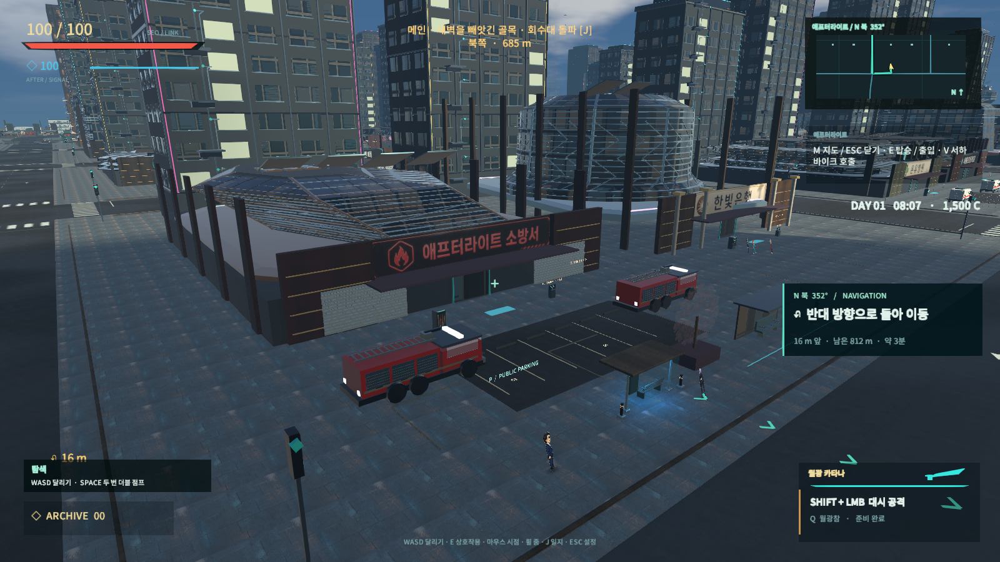
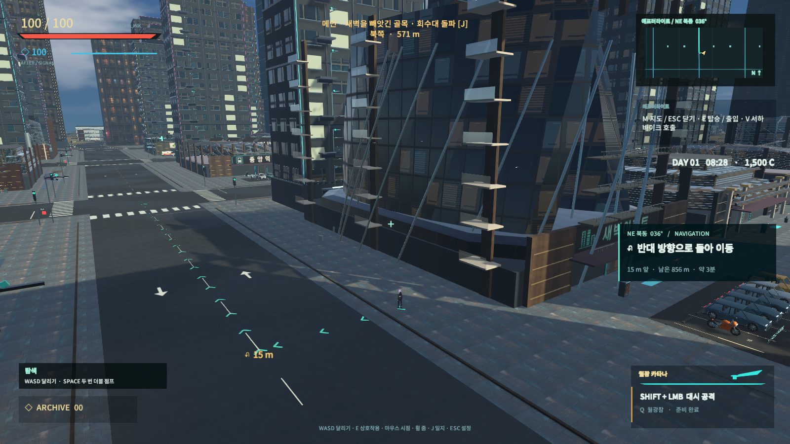
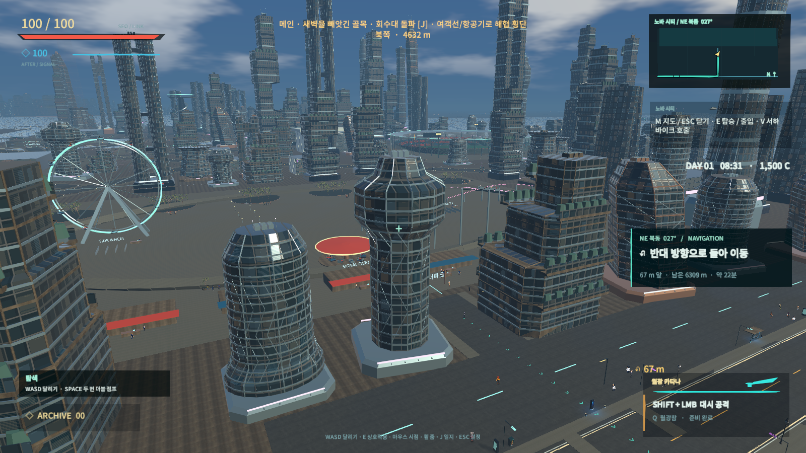

# AFTERSIGNAL · Night Line

서하가 기억을 빼앗긴 도시의 사건을 추적하는 **Unity 오픈월드 액션 게임**입니다. 실제 3D 도시·탈것과 방향별 캐릭터 스프라이트를 조합합니다. 현재 서하는 스프라이트를 사용하며 실험용 3D 모델은 적용하지 않습니다.

Unity **6.4 / 6000.4.0f1**, URP **17.4.0**, Windows 플레이어를 기준으로 개발합니다. 현재 기능과 검증 범위는 [HANDOFF](HANDOFF.md)와 [최근 검증](Documentation/FacilityResponse/README.md)을 확인하세요.

> **공개 소스와 비공개 시각 에셋을 분리했습니다.** 제작한 모델·이미지 원본, 생성 메시·월드 프리팹·씬, 실행 파일은 공개 소스에 포함하지 않습니다. 새로 복제한 소스만으로 현재 게임 화면을 실행할 수는 없습니다. [비공개 에셋 복원 안내](Documentation/PRIVATE-ASSETS.md)를 먼저 확인하세요. 아래 이미지는 실제 플레이어에서 캡처한 화면입니다.

## 플레이 화면

소방서와 전용 대기 소방차.

애프터라이트의 거리와 도로, 시민, 도시 건물.

노바 시티의 문화 시설과 주변 건축물.

## 현재 구현 범위

- **네 도시**: 애프터라이트, 노바 시티, 잠식된 에레보스, 네레이드 수중 도시. 도로·항구·공항·문화 시설과 시설 내부를 연결합니다.
- **생활과 전투**: 작은 집에서 시작, 자연 체력 회복, 더블 점프, 벽 등반, 자유 표면 로프, 무기 구매·장비·탄약, 시설 서비스·일자리·금고.
- **캠페인**: 도시 연대기 메인 33개·서브 22개 의뢰와 기존 열차 캠페인. 전투·구출·탈출·증거 조사에 따라 목표를 전환합니다.
- **NPC**: 직업·시간대·위험 상황에 따른 대화와 반응. 자유 대화에서는 서하의 자동 인사 없이 NPC가 먼저 말합니다. 고정 스토리는 작성된 시나리오를 사용합니다.
- **교통**: 차량·바이크·버스·여객기·배·헬기·탱크·폭격기. 운전과 승객 탑승, 차량 시점, 경적·드리프트, 내구도·단계별 손상, 강한 바이크 충돌 시 탑승자 이탈.
- **도시 사건**: 경찰·군·갱단, 잠식 몬스터, 부상자 구조·이송, 화재 진압. 소방서·경찰서·병원 앞의 자동 생성 주차 차량은 각각 소방차·경찰차·구급차로 제한합니다. 플레이어가 가져온 차량은 삭제하지 않습니다.
- **지도와 복귀**: 현재 위치 중심 지도, 목적지 설정, 도로와 회전 안내. 사망하면 네 도시 중 복귀 장소를 선택하며 기본 선택은 서하의 집입니다.

개발 중인 프로젝트입니다. 거리별 렌더링·NPC 갱신·사건 발생 제한이 적용되어 있지만 모든 지역과 상황 조합의 무오류나 일정 FPS를 보장하지 않습니다. 과거 검증 문서의 수치·화면은 당시 기록이며 현재 기능 설명은 이 README를 기준으로 합니다.

## 실행과 빌드

1. Unity Hub에 **6000.4.0f1**과 Windows Build Support를 설치합니다.
2. 소스를 복제하고 `SETUP.cmd`로 고정 버전 Unity 패키지를 복원합니다.
3. 권한 있는 비공개 에셋 팩을 프로젝트 루트에 복원합니다. 기존 작업 PC에는 로컬 에셋이 그대로 남아 있습니다.
4. Unity Hub에서 파일이 아닌 **이 프로젝트 폴더**를 추가합니다. `OPEN_UNITY.cmd`도 사용할 수 있습니다. 에디터에서 `Assets/AfterSignal/Scenes/19_SeoResidence.unity`를 열고 Play를 누르세요.
5. PowerShell에서 `./Tools/Build-Windows.ps1 -Release`로 빌드합니다.
6. `PLAY.cmd`로 실행합니다. `Builds/active-player.txt`가 가리키는 최신 플레이어를 사용하고, 포인터가 없으면 `Builds/Windows/AFTERSIGNAL.exe`를 사용합니다.

빈 Untitled 씬에서는 게임 월드가 표시되지 않습니다. 최초 가져오기와 빌드에는 시간이 걸립니다. 일반 실행에 씬 재생성 메뉴를 사용할 필요는 없습니다.

### 선택 사항: AI 자유 대화

`Tools/NpcGateway.py`는 Python 로컬 대화 게이트웨이입니다. `.env.local`의 `OPENAI_API_KEY` 또는 같은 이름의 환경 변수가 필요합니다. 키는 Git과 플레이어에 포함하지 않습니다. `PLAY.cmd`는 Python을 찾으면 게이트웨이를 실행합니다. 에디터에서는 게이트웨이를 별도로 시작하세요.

기본 모델 설정은 `gpt-5.6-luna`이며 계정에서 해당 모델을 사용할 수 있어야 합니다. 서버 연결이 없어도 고정 캠페인은 동작하고 NPC의 첫 대사는 상황별 로컬 대사로 대체됩니다. 자유 질의의 실시간 생성에는 정상적인 서버 연결이 필요합니다. 숨은 의뢰의 종류와 보상은 게임 규칙으로 제한합니다.

## 기본 조작

| 입력 | 동작 |
| --- | --- |
| WASD | 달리기 / 운전 중 가속·후진·조향 |
| 마우스 이동 / 휠 | 중앙 조준점 기준 시점 회전 / 확대·축소 |
| 좌클릭 | 장착 무기 공격, 차량 내 개인 무기 사격 |
| 우클릭 | 도보: 표면에 로프 / 무장 탈것: 해당 보조 무장 |
| Space | 점프·더블 점프 / 차량 제동·조향 시 드리프트 / 항공기 상승 |
| Shift / Ctrl | 도보 대시 / 방어, 운전 중 가속 / 항공기 하강 |
| 1–7 / R | 소유 무기 장착 / 장전 |
| E / F / G | 상호작용·운전석 탑승 / 하차·탈출 / 승객 탑승 |
| C / B / V | 차량 시점 / 경적 / 바이크 소환 |
| M / J | 지도 / 의뢰 일지 |
| Esc / Home | 지도·대화 닫기 또는 메뉴 / 시점 초기화 |

시설·탈것별 추가 조작은 화면에 표시됩니다. 새 게임과 이어하기는 서하의 집에서 시작하며 사망 후에는 선택한 도시의 복귀 지점을 사용합니다. 돈·장비·의뢰 진행은 로컬에 저장됩니다.

## 개발과 공개 자원 정책

- `Assets/AfterSignal/Runtime/`: 전투·도시 생활·교통·월드·UI·최적화 코드.
- `Assets/AfterSignal/Editor/`, `Tools/`: 에셋 가져오기, 월드 제작, 빌드·검증 도구.
- `Assets/AfterSignal/Tests/`, `Runtime/Diagnostics/`: 회귀 검증과 명시적 실행 플래그가 필요한 네이티브 진단.
- `Documentation/Screenshots/`: 공개 게임 플레이 캡처. 이미지 원본·스프라이트 시트·모델 렌더링은 넣지 않습니다.
- [코드 구조](Documentation/PROJECT-STRUCTURE.md) · [출처와 라이선스](Documentation/ASSETS.md) · [비공개 에셋 정책과 과거 이력의 한계](Documentation/PRIVATE-ASSETS.md).

커밋 전 `node Tools/public-assets.cjs`로 공개 금지 에셋의 추적 여부를 검사합니다. 로컬 훅은 `git config core.hooksPath .githooks`로 설치하며 GitHub Actions에서도 같은 검사를 실행합니다. 검사 도구는 Node.js 24를 사용합니다. 게임 실행에는 Node.js가 필요하지 않습니다.
